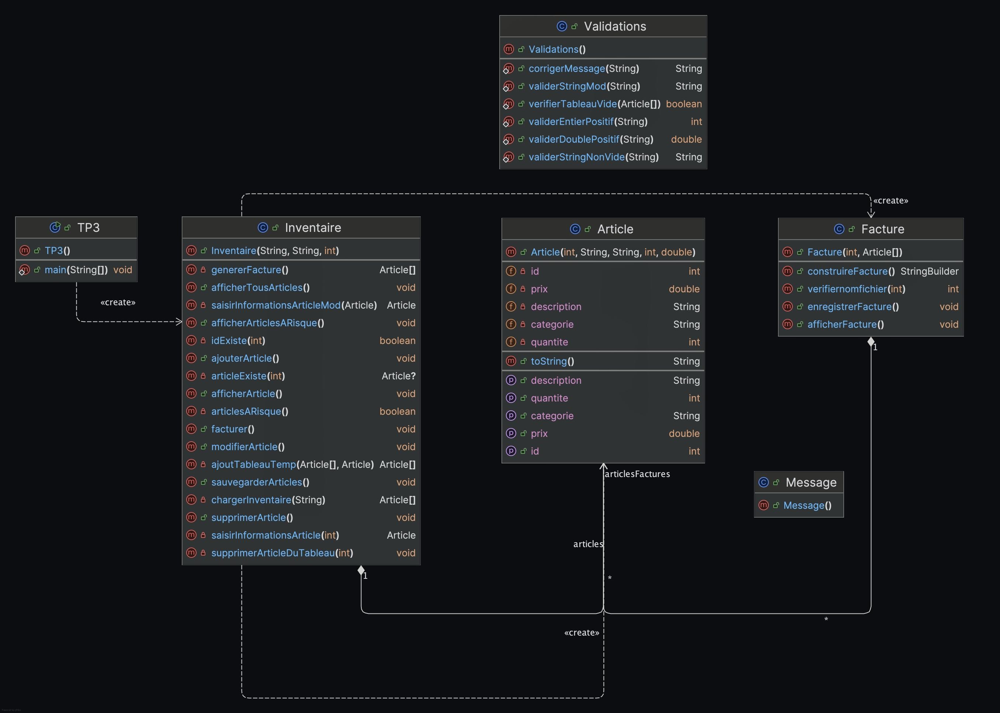

# TP3

Ce projet d'encapsulation permet de gérer un inventaire d'articles en Java. Il permet d'ajouter, de modifier, de supprimer et d'afficher des articles. L'application prend également en charge la gestion des stocks, la facturation des articles, et l'enregistrement des données dans un fichier.

## Fonctionnalités

- **Ajouter un article** : Permet d'ajouter un nouvel article dans l'inventaire ou de mettre à jour la quantité d'un article existant.
- **Afficher un article** : Affiche les informations détaillées d'un article en utilisant son ID.
- **Afficher tous les articles** : Affiche la liste complète des articles avec des avertissements pour les articles à faible stock.
- **Supprimer un article** : Permet de supprimer un article en utilisant son ID.
- **Modifier un article** : Permet de modifier les informations d'un article existant (catégorie, description, quantité, prix).
- **Afficher les articles à risque** : Affiche les articles dont la quantité est inférieure ou égale à 5.
- **Générer une facture** : Permet de créer une facture basée sur les articles achetés par un client, avec un suivi de la quantité restante.
- **Quitter avec une sauvegarde** : Sauvegarde l'inventaire actuel dans un fichier texte.

## Structure du projet

- **`Inventaire.java`** : Classe qui contient la logique de gestion de l'inventaire.
- **`Article.java`** : Classe représentant un article dans l'inventaire avec ses attributs (ID, catégorie, description, quantité, prix).
- **`Validations.java`** : Classe pour la validation et la correction des entrées de l'utilisateur.
- **`Facture.java`** : Classe qui gère la création de la facture ainsi que son fichier.
- **`Message.java`** : Classe qui contient les messages d'erreur et d'information affichés à l'utilisateur.
- **`TP3.java`** : Classe principale qui contient le main.




## Prérequis

Pour exécuter ce projet, vous devez avoir installé Java sur votre machine.

- [Java JDK](https://www.oracle.com/java/technologies/javase-jdk11-downloads.html)
- IDE (Optionnel mais, recommandé) sinon, servez-vous du terminal de votre machine avec le script bash en dessous.

## Installation

1. Clonez le dépôt avec le lien.
2. Assurez-vous d'avoir Java installé.
3. Compilez et exécutez le projet.

```bash

git clone https://github.com/djlord-it/TP3.git
cd TP3/src
javac *.java
java TP3
